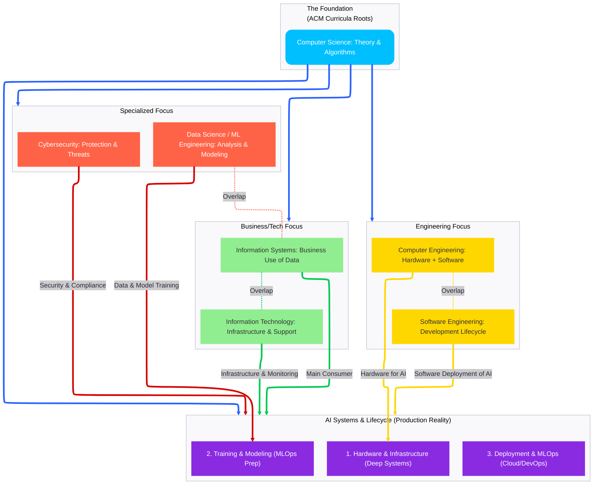
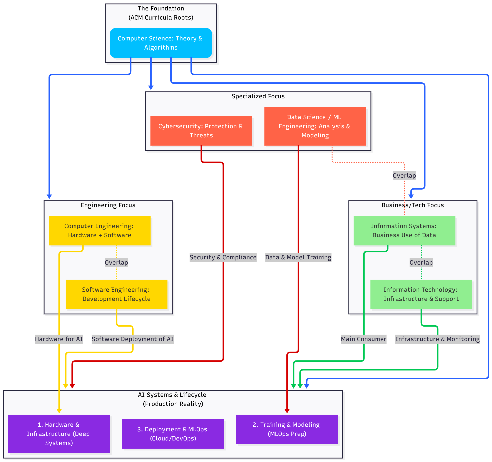

# AI Systems Grounding in Computing Disciplines

-----

Owner: Vadim Rudakov, lefthand67@gmail.com  
Version: 0.1.0   
Birth: 2025-12-05  
Last Modified: 2025-12-05

-----

> INFO: *The handbook is optimized for environments supporting Mermaid.js diagrams. For static export, rasterized versions are available in Appendix A.*

This document maps the AI System Lifecycle to the foundational disciplines defined by the **ACM/IEEE Joint Task Force on Computing Curricula** (available at https://www.acm.org/education/curricula-recommendations). This provides a structured, world-adopted context for the roles and required expertise within our AI Engineering team.

The table below and the subsequent diagram are based on the **official ACM/IEEE Computing Curricula**. However, our diagram introduces the **AI Lifecycle** as a new primary branch stemming from these foundational disciplines, illustrating how each phase is grounded in a specific computing area.

| Discipline | Latest Version | Brief Description | Target Audience/Focus Areas | Key Differences/Overlaps |
| :--- | :--- | :--- | :--- | :--- |
| **Computer Engineering** | CE2016 (2016) | Curriculum guidelines for undergraduate degree programs. | Undergraduate programs in Computer Engineering. | Focuses on **hardware-software integration**; crucial for specialized accelerator design (e.g., TPUs, ASICs). |
| **Computer Science** | CS2023 (2023) | Curriculum guidelines for undergraduate programs. | Undergraduate programs in Computer Science. | Broad foundational computing; emphasizes **theoretical aspects, algorithms, and complexity**. |
| **Cybersecurity** | CSEC2017 (2017) | Curriculum guidelines for post-secondary degree programs, with foundational supplements. | Post-secondary degree programs in Cybersecurity. | Focuses on **security competencies**; essential for robust, compliant MLOps deployment. |
| **Data Science** | CCDS2021 (2021) | Computing competencies for undergraduate data science curricula. | Undergraduate programs with a data science focus. | Integrates computing with statistics; emphasizes **analysis, modeling, and machine learning principles**. |
| **Information Systems** | IS2020 (2020) | A competency model for undergraduate programs. | Undergraduate programs in Information Systems. | Emphasizes **business and system competencies**; organizational use of information. |
| **Information Technology** | IT2017 (2017) | Curriculum guidelines for baccalaureate degree programs. | Baccalaureate programs in Information Technology. | Focuses on practical **infrastructure and support**; vital for monitoring and platform maintenance. |
| **Software Engineering** | SE2014 (2014) | Curriculum guidelines for undergraduate degree programs. | Undergraduate programs in Software Engineering. | Specific to the **software development lifecycle**; emphasizes engineering practices, design, and testing. |

**Breakdown of AI Grounding (Production Context)**

1.  **Hardware & Infrastructure (AIH)**

      * **Grounded in:** **Computer Engineering** (CE2016).
      * **Production Context:** This covers the high-performance computing clusters, hardware-software co-design, and deep optimization required for specialized chips (GPUs/TPUs). **A deep understanding requires principles rooted in Electrical Engineering** for those working on custom accelerator design or low-level memory management.

2.  **Training & Modeling (AIT)**

      * **Grounded in:** **Data Science / Machine Learning Engineering** (CCDS2021).
      * **Production Context:** While Data Science covers the *principles* (data preparation, model selection), the engineering team applies this as **Machine Learning Engineering (MLE)**, focusing on efficient model training, versioning, and readiness for MLOps pipelines.

3.  **Deployment & MLOps (AID)**

      * **Grounded in:** **Software Engineering** (SE2014), **Information Technology** (IT2017), and **Cybersecurity** (CSEC2017).
      * **Production Context:** This phase synthesizes multiple disciplines and **MUST adhere to modern Cloud Engineering and DevOps/SRE standards**, moving beyond the scope of the older SE/IT curricula.
          * **Software Engineering** handles the model integration into scalable, robust, production-grade applications.
          * **Information Technology** handles the underlying cloud infrastructure, logging, and performance monitoring (the "Ops" of MLOps).
          * **Cybersecurity** ensures the system meets compliance, integrity, and threat-response requirements crucial for a trusted production service.

## Appendix A. Renderred Diagram

