# A-26005: Agentic OS Filesystem Architecture: Document Types, VFS, and Virtual Relational Layer

## Problem Statement

The repository has 13 distinct document types but only 4 have formal interfaces (schema + validation + lifecycle). The remaining 9 exist by convention, not by contract. This creates the "Architectural Orphanage" problem (first identified in S-26004): documents outside governed decision-making cannot be reliably discovered, filtered, or validated — by humans or AI agents.

ADR-26035 established the Evidence taxonomy (Decisions / Evidence / Governance) and proved it works with 4 analyses, 5 formal sources, and a working validation script. But the taxonomy only covers architecture-related documents. Content notebooks, script instructions, guides, plans, and promotional posts remain untyped. There is no uniform interface that defines what "a document type" is across the repo.

The Agentic OS model (A-26002, S-26005) positions documentation as the file system of an AI-native operating system. In UNIX, every file has a type and metadata (the inode). In this system, every document should have a type and metadata (YAML frontmatter). The gap: UNIX has a VFS layer that provides a uniform interface across all file types. This repo has no equivalent — each validation script implements its own type-specific logic with no shared abstraction.

Beyond the typing gap, there is a **relational integrity gap**. Documents reference each other — analyses cite sources (`sources: [S-26004]`), ADRs produce artifacts (`produces: [ADR-26035]`). These are foreign key relationships, but no validation enforces them. A source ID can be typo'd, a referenced ADR can be deleted, and no CI gate catches it. The knowledge base has referential links but no referential integrity.

There is also an **integration gap**. The Agentic OS model (A-26002) describes three layers — Control Plane (governance), Kernel (cognitive processing), Execution (sandboxed skills) — but the filesystem architecture that ties them together is not formalized. The document type system sits at the intersection of all three layers: governance defines types, the kernel queries types for routing, and execution produces new typed documents. Without a unified filesystem design, these layers cannot interoperate reliably.

This analysis applies two theoretical foundations — **UNIX system design** and **Codd's relational theory** — as blueprints to design the Agentic OS filesystem architecture, with Document Type Interfaces as the VFS layer and a Virtual Relational Layer (VRL) providing referential integrity over Git/YAML.

**Interim artifact caveat.** This analysis is itself an interim artifact. The Agentic OS methodology is under active revision — ADRs, the evidence pipeline, and the document type taxonomy are all subject to redesign as the OS architecture crystallizes. The structures described here should be understood as the current best model, not a final specification. The focus is on **interfaces** (stable contracts) rather than **implementations** (which will evolve).

## Key Insights

### The Documentation Landscape — 13 Types, 4 Governed

| # | Type | Location | Validation | Interface Level |
|---|------|----------|------------|-----------------|
| 1 | ADR | `architecture/adr/` | `check_adr.py` | Full (schema + sections + lifecycle) |
| 2 | Analysis | `evidence/analyses/` | `check_evidence.py` | Full |
| 3 | Retrospective | `evidence/retrospective/` | `check_evidence.py` | Full |
| 4 | Source | `evidence/sources/` | `check_evidence.py` | Full |
| 5 | Notebook | `ai_system/*/` | `jupytext_sync/verify` | Partial (Jupytext + naming) |
| 6 | Script Instruction | `tools/docs/scripts_instructions/` | `check_script_suite.py` | Partial (existence only) |
| 7 | Git Workflow Guide | `tools/docs/git/` | link checks only | None |
| 8 | Manifesto | `architecture/` | none | None |
| 9 | Telegram Post | `misc/pr/` | none | None |
| 10 | Plan | `misc/plan/` | none | None |
| 11 | Tech Debt Register | `misc/plan/techdebt.md` | none | None |
| 12 | Package Spec | `architecture/packages/` | none | None |
| 13 | Prompt (JSON) | `ai_system/3_prompts/consultants/` | `check_json_files.py` (syntax) | None |

Types 1-4 are the "governed" types — they have schema, validation, and lifecycle. Types 5-6 have partial interfaces (Jupytext enforcement, naming conventions). Types 7-13 are "untyped" — they exist by convention, not by contract.

### Industry Convergence — The 4-6 Base Types

Across DITA (OASIS), Diataxis, ISO 26514, Google, and GitLab CTRT, a stable set of 4-6 base types emerges:

| Semantic Role | DITA | Diataxis | ISO 26514 | Google | GitLab CTRT |
|--------------|------|----------|-----------|--------|-------------|
| "What is it?" | Concept | Explanation | Conceptual | Conceptual | Concept |
| "How do I do it?" | Task | How-to Guide | Instructional | — | Task |
| "Teach me" | — | Tutorial | — | Tutorial | Tutorial |
| "Look it up" | Reference | Reference | Reference | Reference | Reference |
| "Fix a problem" | Troubleshooting | — | Troubleshooting | — | Troubleshooting |
| "Why decided?" | — | — | — | Design Doc | — |

The "Design Doc" gap: none of the standard taxonomies have a first-class type for architectural decisions. ADRs (Michael Nygard, 2011) fill this gap. This repo's ADR system is an innovation relative to documentation standards.

### DITA Specialization — The Interface Inheritance Model

DITA implements **document type inheritance** — the most mature precedent for typed documentation:

```
topic (base type — abstract interface)
├── concept (extends topic — adds conbody)
├── task (extends topic — adds steps, prerequisites)
├── reference (extends topic — adds tables, parameter lists)
└── troubleshooting (extends topic — adds cause, remedy)
```

Key properties:
- **Schema-validated**: Each type has a DTD/RELAX NG schema enforcing structure
- **Extensible**: Organizations create custom types that inherit from base types
- **Constraint modules**: Can restrict base types without breaking the contract (narrowing, not widening)
- **Processing inheritance**: A processor that handles `topic` automatically handles all its specializations

DITA proves typed documentation with formal interfaces is production-viable at enterprise scale (IBM, SAP, Cisco). But DITA's XML toolchain is antithetical to Markdown-native docs-as-code. The opportunity: bring DITA's conceptual model (typed topics with schema validation) into a Markdown/YAML world.

### Modern Type Systems for Markdown

| Tool | Schema Language | Validates | Status |
|------|----------------|-----------|--------|
| **Astro Content Collections** | Zod (TypeScript) | Frontmatter | Production-ready |
| **Contentlayer** | JS config | Frontmatter + routing | Stalled (2023) |
| **mdschema** | YAML | Body structure (sections, headings) | Early stage |

Astro Content Collections is the most mature precedent — Zod schemas for frontmatter validation in a content-centric framework. Our `check_adr.py` and `check_evidence.py` already implement this pattern — but in Python/YAML, without a shared abstraction.

### AI-Native Documentation Standards

Two emerging standards address AI consumption directly:

- **`llms.txt`** (Jeremy Howard, 2024) — A discovery interface for AI agents: structured Markdown listing all content with descriptions. Adopted by Anthropic, Google (A2A), Mintlify.
- **`skill.md`** (Mintlify) — A capability manifest telling agents what a product/system can do.

Both validate the manifesto's thesis: documentation is not just for humans anymore. AI consumers need machine-readable metadata to filter before they read. This is the Progressive Disclosure pattern from A-26002: the agent reads frontmatter `type` + `tags` + `description` fields (Level 1) to decide whether to load the full document (Level 2) — saving tokens.

### Metadata for RAG Filtering

Research on production RAG systems converges on these critical metadata fields:

- `document_type` — enables query-type routing ("teach me" → tutorial, "look up" → reference)
- `status` / `lifecycle_stage` — filters out deprecated/draft content
- `tags` — controlled vocabulary for domain classification
- `date` / `last_updated` — recency filtering
- `audience` — skill-level routing
- `description` — compact summary for Level 1 discovery

Dublin Core (ISO 15836) provides a standardized 15-element metadata set. Schema.org provides `TechArticle`, `HowTo`, `LearningResource` types. Both are reference vocabularies, though neither is directly usable as a validation schema.

### Duplication in Validation Scripts — The Common Kernel

Six shared patterns are duplicated across 2+ scripts:

| Pattern | Scripts Using It | Duplication |
|---------|-----------------|-------------|
| Frontmatter Parsing (regex + YAML) | `check_adr.py`, `check_evidence.py` | ~15 LOC × 2 |
| Section Extraction (code fence removal + heading regex) | `check_adr.py`, `check_evidence.py` | ~10 LOC × 2 |
| File Discovery (rglob + exclusion filtering) | `check_broken_links.py`, `check_link_format.py`, `check_json_files.py` | ~40 LOC × 3 |
| Config Loading (repo root → pyproject.toml → YAML) | `check_adr.py`, `check_evidence.py`, `validate_commit_msg.py` | ~25 LOC × 3 |
| Git Client (root, staged files, renamed files) | `check_adr.py`, `check_evidence.py`, `check_link_format.py`, `check_script_suite.py` | ~20 LOC × 4 |
| CLI / Error Reporting (argparse + exit codes) | All 10 scripts | ~30 LOC × 10 |

Per SVA (ADR-26037): extraction is justified only when duplication causes maintenance pain or behavioral inconsistency. The first three patterns (frontmatter, sections, file discovery) are the strongest candidates — they implement the same logic with the same bugs and the same edge cases.

### Virtual Relational Layer — Codd's Theory Applied to Git/YAML

Traditional filesystems are hierarchical and opaque — they organize by location, not by relationship. Codd's relational model (1970) solved this exact problem for data: **Data Independence** — the logical structure of data is independent of its physical storage. The same principle applies to the Agentic OS filesystem.

S-26006 proposes a **Virtual Relational Layer (VRL)** — treating the Git repository as a relational system without introducing an actual database (which would violate SVA C4: Orchestration Bloat):

| Relational Concept | VRL Implementation | Example |
|---|---|---|
| **Tuple (row)** | YAML frontmatter (1NF — each field is atomic) | `id: A-26005`, `title: "..."`, `date: 2026-03-07` |
| **Primary Key** | `id` field (globally unique, namespace-prefixed) | `A-26005`, `S-26006`, `ADR-26035` |
| **Foreign Key** | `sources`, `produces`, `extracted_into` fields | `sources: [S-26004, S-26005]` |
| **Schema** | `evidence.config.yaml`, `adr_config.yaml` | Required fields, controlled vocabularies |
| **Shared Attribute Table** | `architecture.config.yaml` (parent config) | Tag vocabulary, shared metadata |
| **Transaction** | Git commit (atomic, all-or-nothing) | Single commit changes source + analysis |
| **Transaction Log** | Git history (append-only, durable) | `git log --all --full-history` |
| **Constraint Check** | Validation scripts in CI/CD | `check_evidence.py` validates FK existence |
| **Materialized View** | Build-time `catalog.json` (future) | Pre-computed index for agent queries |

**Git provides ACID properties:**
- **Atomicity** — a commit either succeeds entirely or fails entirely
- **Consistency** — pre-commit hooks enforce schema constraints before writes
- **Isolation** — branches provide working isolation (worktrees for parallel agents)
- **Durability** — committed history is permanent; even deleted sources are recoverable via `git log --all --full-history`

**Referential integrity** is the critical gap. Currently, an analysis can declare `sources: [S-99999]` and no validation catches the invalid FK. The VRL design requires a referential integrity gate: CI/CD validates that every value in `sources: []`, `produces: []`, and `extracted_into` exists as a valid primary key in the ecosystem. This is the `check_evidence.py` equivalent of a database FK constraint.

**Normalization principles apply — but only to metadata.** Shared attribute tables (tag vocabularies, controlled status values) already live in config files rather than being duplicated in every document. This is 2NF normalization. The document body (Markdown text) remains denormalized — it is the "unstructured payload" that the relational layer does not govern. Over-normalizing the body would create artificial JOIN dependencies that hurt readability without improving integrity.

**The JOIN problem.** Filesystems do not natively support JOINs. If an agent needs to answer "What ADRs resulted from research source S-26004?", it must scan the metadata of all ADR files looking for `sources` containing `S-26004`. For small repos this is acceptable. At scale, the solution is a **materialized view** — a `catalog.json` generated at build time that pre-computes the relational graph, enabling O(1) lookups by the agent. This is analogous to database indexing.

```mermaid
graph LR
    subgraph Git_Layer ["Git (Transaction Log)"]
        Commit[Atomic Commit = Transaction]
        History[Git History = Durability]
    end

    subgraph VRL ["Virtual Relational Layer"]
        FM["YAML Frontmatter = Tuple (1NF)"]
        PK["id: A-26005 = Primary Key"]
        FK["sources: S-26004 = Foreign Key"]
        Config["config.yaml = Shared Attribute Table"]
    end

    subgraph Validation ["Validation = DBMS"]
        IntCheck["check_evidence.py = FK Constraint"]
        LinkCheck["check_broken_links.py = Referential Integrity"]
        Catalog["catalog.json = Materialized View"]
    end

    Git_Layer --> VRL
    VRL --> Validation

    style Git_Layer fill:#e8eaf6,stroke:#283593
    style VRL fill:#fff8e1,stroke:#f57f17
    style Validation fill:#e8f5e9,stroke:#2e7d32
```



S-26006 rates the VRL methodology at WRC 0.925 (Production-Ready): E=0.95 (Codd's relational algebra is the most validated data theory in existence), A=0.85 (used in data catalogs and semantic web standards), P=0.95 (native to Git/YAML stack, zero runtime overhead).

### Contract-Based Documentation — Docs as ISA

S-26006 introduces a conceptual reframing that extends the AI-First Methodology principle: documentation is not just "content consumed by agents" — it is the **Instruction Set Architecture (ISA)** for the LLM processor.

In traditional computing:
- The **ISA** (x86, ARM) defines the contract between software and hardware — what instructions the processor can execute
- **Header files** (.h) define the interface between caller and callee — what functions exist and their signatures
- The **ABI** defines calling conventions — how data is passed between components

In the Agentic OS:
- **Doc-Type Interfaces** are the ISA — they define what "instructions" (document types) the system recognizes
- **YAML frontmatter** is the header file — it declares the document's interface (type, capabilities, dependencies)
- **Validation schemas** are the ABI — they enforce the contract between producers and consumers of documents

This three-level layering has a precise precedent in HPC engineering. The [GEMM handbook](/ai_system_layers/1_execution/algebra_gemm_engineering_standard.ipynb) documents the BLAS Interface / API / ABI hierarchy:

| Layer | BLAS (HPC) | Agentic OS (Documentation) |
|---|---|---|
| **Interface** (semantic contract) | BLAS specification: "`SGEMM` must perform {math}`C = \alpha AB + \beta C`" | Doc-Type Interface: "an ADR must have status, sections, lifecycle" |
| **API** (source-level binding) | CBLAS header: `void cblas_sgemm(...)` | YAML config: `adr_config.yaml` (field names, controlled vocabularies) |
| **ABI** (runtime binding) | Compiled `.so` with calling conventions | Validation script: `check_adr.py` (the executable validator) |

The BLAS standard originated c. 1972 and still governs HPC 50+ years later — implementations changed (Fortran → C → CUDA → ROCm), hardware changed (mainframes → GPUs → TPUs), but the **interface survived**. The GEMM handbook documents a cautionary counterexample: Soviet engineers built math code specific to the BESM-6 machine without standard interfaces, making migration to new hardware an arduous multi-year process.

The lesson for the Agentic OS: **the interface is the asset, not the implementation.** Document Type Interfaces (`adr_config.yaml`, `evidence.config.yaml`) should be designed to outlive any specific validation tool (vadocs), agent (Claude, Gemini), or infrastructure (Git, GitHub Actions). Implementations will be replaced; interfaces persist.

This creates a **Self-Documenting Runtime** where:
- The **Documentation** is the **Control Plane** — it defines what the system is, what it decided, and what it can do
- The **Agent/Sandbox** is the **Data Plane** — it executes tasks governed by the documentation contracts
- The **Validation Engine** (vadocs) is the **Linker** — it ensures interface compliance before "execution" (deployment)

The practical implication: when a new agent (Claude, Gemini, a local SLM) connects to this system, it reads the Doc-Type Interfaces to understand what the system offers — the same way a compiler reads header files to understand what functions are available. The agent doesn't need system-specific training; it needs to read the ISA.

## Taxonomy Design

### The UNIX Blueprint — Document Types as File Types

S-26005 provides the foundational UNIX ↔ Agentic OS mapping from Bach (*The Design of the UNIX Operating System*) and Billimoria (*Linux Kernel Programming*):

| UNIX/Linux Concept | Agentic OS Equivalent | Functional Comparison |
|---|---|---|
| CPU / Instruction Set | LLM Engine | Executes tokens instead of binary opcodes |
| Kernel (Scheduler) | Agent Framework | Orchestrates task flow, manages context windows |
| System Calls (open, read, write) | Tool Invocations | Controlled interfaces to external resources |
| User Space Processes | Skills / Plugins | Modular capabilities on top of the agent framework |
| Memory Management (VM/Paging) | Context Window Management | Swapping information in/out of context (RAG) |
| File System | Knowledge Base / Vector Store | Persistent storage and retrieval |
| Permissions (UID/GID) | Policy & Safety Guards | Controlling tool/skill execution |
| Kernel Modules (LKM) | Dynamic Skill Loading | New capabilities without restarting |

**The missing row** — S-26005 doesn't map file types to the Agentic OS. This analysis fills that gap:

| UNIX Concept | Agentic OS Equivalent | This Repo's Implementation |
|---|---|---|
| **File types** (regular, directory, socket, pipe, device) | **Document types** (adr, tutorial, analysis, source, guide) | 13 types discovered, 4 governed |
| **VFS** (Virtual File System) | **Document Type Registry** | Does not exist yet (the gap) |
| **inode metadata** (size, permissions, timestamps, type) | **YAML frontmatter** (id, title, date, status, tags, type) | Partial — only governed types have frontmatter |
| **`stat()` syscall** (read inode without opening file) | **`parse_frontmatter()`** (read metadata without parsing body) | Duplicated across `check_adr.py` and `check_evidence.py` |
| **`file` command** (detect type from magic bytes) | **`resolve_type(path, frontmatter)`** (detect type from location + metadata) | Does not exist — type is implicit from directory |
| **File permissions** (rwx for owner/group/other) | **Document lifecycle** (status controls valid operations) | Only ADRs and evidence have lifecycle |
| **Mount point** (where a filesystem is attached) | **Directory convention** (where a type's files live) | Implicit — no registry maps directories to types |
| **File descriptor** (handle for open file) | **Document model** (in-memory representation) | vadocs `Document` dataclass (v0.1.0 PoC) |
| **VFS operations** (open, read, write, close) | **Validation primitives** (parse, extract, validate, fix) | Duplicated per-script, not abstracted |

### The VFS Analogy — Why It Matters

In UNIX, the VFS is the critical abstraction that allows applications to work with files regardless of the underlying filesystem (ext4, NFS, tmpfs). The `open()` syscall works the same whether the file is on a local disk or a network mount. The application never knows the difference.

In the Agentic OS, the Document Type Registry would serve the same role: a validation script (or an AI agent) calls `parse_frontmatter()` and `extract_sections()` without knowing whether the document is an ADR, a tutorial, or a retrospective. The registry resolves the type and returns the appropriate schema and validators.

Without the VFS, UNIX applications would need filesystem-specific code for every operation. Without the Document Type Registry, validation scripts duplicate type-specific logic — which is exactly the current state (6 duplicated patterns across 10 scripts).

### The inode Metadata Model — Frontmatter as the Document Header

In UNIX, every file has an inode — a fixed-size metadata record that the kernel reads without opening the file body. The `stat()` syscall returns inode data instantly, enabling `ls -l`, `find`, `du`, and every file operation to make decisions before performing I/O. The inode is the **entry point** for all file operations.

In the Agentic OS, YAML frontmatter serves the same role. It is the **entry point** for an LLM to understand a document. An agent reads frontmatter (the `stat()` call) to decide whether to read the body (the `read()` call). This is the Progressive Disclosure pattern (A-26002): metadata filtering saves tokens the same way `stat()` saves disk I/O.

The inode analogy must be taken seriously — each field must justify its existence as essential metadata:

| inode field | Agentic OS equivalent | Document frontmatter field | Justification |
|---|---|---|---|
| `i_mode` (file type) | What kind of document | `type: adr` | Agent routing: "What was decided?" → filter to type `adr` |
| `i_mode` (permissions) | Lifecycle stage | `status: accepted` | Agent filtering: skip deprecated/draft content |
| `i_size` (file size in bytes) | **Token budget cost** | `token_size: 2450` | **Context budget planning**: can I fit this document? |
| `i_mtime` (modification time) | Last meaningful update | `date: 2026-03-06` | Recency filtering |
| `i_ctime` (creation time) | Birth date | `birth: 2026-02-15` | Document age tracking |
| `i_uid` (owner) | Document author | `author: rudakow.wadim@gmail.com` | Provenance |
| `i_nlink` (hard link count) | Cross-references | `produces: [ADR-26035]` | Dependency graph (type-specific) |
| — (no UNIX equivalent) | **Human-readable summary** | `description: "..."` | **THE critical field** — see below |
| — (no UNIX equivalent) | Semantic classification | `tags: [governance]` | Domain filtering for RAG and agent routing |
| — (no UNIX equivalent) | Artifact version | `version: 1.0.0` | Production traceability (SemVer per AVP policy) |

#### The `description` Field — Context Management Mechanism

The `description` field has no UNIX inode equivalent because UNIX files don't need to explain themselves to a probabilistic processor. But in the Agentic OS, **every document competes for the agent's finite context window**. The description is the document's elevator pitch — it lets the agent decide in ~20 tokens whether to spend ~2000 tokens reading the body.

This is not a nice-to-have. It is a **context management mechanism**. Without description:
- Agent reads 13 frontmatters → no basis to choose → reads all 13 bodies → context exhausted
- Agent must rely on title alone → ambiguous → wrong document loaded → hallucination

With description:
- Agent reads 13 frontmatters with descriptions → filters to 2 relevant docs → reads 2 bodies → context preserved
- Description serves as Level 1 in the three-level Progressive Disclosure: `description` → `sections` → `full body`

The description must be:
- **Short**: 1-2 sentences, under 200 characters (roughly 50 tokens)
- **Functional**: describes what the document **provides**, not what it **is** ("Defines the evidence taxonomy and three-commit workflow for source lifecycle" vs. "An ADR about evidence")
- **Agent-optimized**: answers the question "should I read this?" for the most effective context loading.

## References

- S-26004: Evidence taxonomy and source lifecycle
- S-26005: UNIX and Agentic OS mapping
- S-26006: Virtual Relational Layer design
