I write a git handbook for the developers working with AI tools. Now I concentrate on architectural tagging for AI changelog generation. I still do not completely understand how they are used and how I should combine them with regular git prefixes. I attach all materials I have, please, explain me what I am doing wrong and whether these topics are really relevant:

## 1\. 🏷️ Mandatory Architectural Tags Explained

The **MANDATORY TAGS** are a core part of the system's **Interpretability** and **Traceability** requirements, specifically designed to enforce **architectural intent** on non-functional code changes within the Small LLM's output [ISO 29148: Verifiability].

For standard features (`feat`) or fixes (`fix`), the Git range is sufficient. However, for internal changes like `refactor` or `remove`, the code itself doesn't always explain the *why*. These tags solve that.

| Mandatory Tag | Purpose & Architectural Intent | **Best Used For** |
| :--- | :--- | :--- |
| **`#DEPRECATION-PLANNED`** | **Sunset Management.** Marks a component or feature that has been removed now but was previously announced as scheduled for removal (i.e., this is the final cleanup). | `Removed` entries, or `Changed` entries where APIs are marked for removal in a future release. |
| **`#TECHDEBT-PAYMENT`** | **Quality Management.** Signifies the removal of existing complexity, the refactoring of spaghetti code, or the update of insecure/outdated dependencies, specifically to reduce **technical debt**. | `Refactor` entries targeting legacy code cleanup or dependency updates. |
| **`#REFACTOR-MIGRATION`** | **Structural Change.** Indicates a significant shift in component architecture, such as moving from one framework to another (e.g., Markdown prompts to JSON prompts), or migrating large code blocks to a new directory/module. | Major `Changed` or `Refactor` entries where the component's internal structure is fundamentally altered. |
| **`#PERF-OPTIMIZATION`** | **Non-Functional Requirement.** Indicates a change driven purely by the need to improve metrics like latency, memory usage, or startup time, without altering external functionality. | `Perf` type entries, specifically where diffs show low-level changes to algorithms or resource-intensive loops. |

The SLLM's job is to read the diff for a `refactor` or `remove` and choose the **most fitting tag** from this list. This makes the output **unambiguous** and serves as a direct communication channel about architectural health to the rest of the development team.


# Architectural Tagging Handbook for SLLM-Driven MLOps

## Philosophy
Architectural tags declare the primary non-functional intent of refactor or remove changes in commit messages, enabling automated changelog generation, technical debt tracking, and architecture reviews in SLLM-driven workflows. Small Language Models (SLLMs: 1B-14B parameter models running locally for code generation via tools like aider) classify changes into exactly one tag from a fixed set, keeping classification low-latency (~50 tokens).

**Commit Format Mandate**  
Use this exact parseable format as the first body line:  
```
ArchTag: #TAG-NAME
```
Example:  
```
refactor: split monolithic trainer into modules

ArchTag: #REFACTOR-MIGRATION
```

Real-world example: Angular's conventional commits parse `feat!` for breaking changes to auto-generate changelogs, similar to how these tags trigger MLOps gates. Pitfall: Vague formats like free-text tags fail regex validation in CI. Tech debt: Multiple formats require brittle parsers, breaking changelog bots over time.[13][14][15]

## SLLM Prompting Protocol
Prepend this snippet to SLLM prompts for detected refactor/remove diffs:  
```
ARCHITECTURAL TAGGING MANDATE:
Analyze the Git diff (refactor/remove). Select ONE tag: #DEPRECATION-PLANNED, #TECHDEBT-PAYMENT, #REFACTOR-MIGRATION, #PERF-OPTIMIZATION.
Output ONLY: ArchTag: #YOUR-TAG
FAILURE TO INCLUDE VALID FORMAT BLOCKS COMMIT.
Few-shot:
Diff1: [delete deprecated public func] → ArchTag: #DEPRECATION-PLANNED
Diff2: [list→dict in hot loop] → ArchTag: #PERF-OPTIMIZATION
```

Enforce via pre-commit hook rejecting invalid tags. Real-world example: GitHub Actions parse commit bodies for labels to route workflows. Pitfall: Prompt-only enforcement lets SLLMs hallucinate tags. Tech debt: No hooks mean manual fixes, eroding automation trust.[2]

## Mandatory Tags

| Tag                  | Rationale                          | Selection Heuristic                          | Automation Triggers                          | Example Diff Snippet |
|----------------------|------------------------------------|----------------------------------------------|----------------------------------------------|----------------------|
| #DEPRECATION-PLANNED | Sunset public APIs safely.        | Delete file/class/public func previously @deprecated. | Update API docs; block tests using deleted elements. | ```-def old_public_api(): #deprecated```
| #TECHDEBT-PAYMENT    | Improve maintainability metrics.  | OOP conversion; complexity drop; dep upgrades. | Reduce tech debt score; retest stability.    | ```-if cond: foo() # → class Foo: def foo()```
| #REFACTOR-MIGRATION  | Preserve docs after restructure.  | File moves across dirs; pattern shift (mono→micro). | Architect review; update SAD.                | ```mv trainer.py pipelines/training/```
| #PERF-OPTIMIZATION   | Evidence edge deployment gains.   | Loop/data struct changes; quant tweaks w/ benchmarks. | Run perf suite; log latency delta.           | ```-for i in lst: # → d = {..}; i in d```

Real-world example: Databricks MLOps tags pipeline restructures for lakehouse migration, triggering docs regen. Pitfall: Overlapping heuristics (e.g., perf refactor as both tags) needs dominant intent rule. Tech debt: Unclear examples lead to 20-30% misclassification, inflating review load.

```mermaid
graph TD
    A[Commit w/ Tag] --> B[Tag]
    B -->|#PERF| C[Perf Tests]
    B -->|#REFACTOR| D[Architect Review]
    B -->|#DEPRECATION| E[API Docs Update]
    B -->|#TECHDEBT| F[Debt Score Δ]
    C --> G[Changelog Section]
    D --> G
    E --> G
    F --> G
```



## Pitfalls & Mitigations

- **Tag Misclassification**: SLLM picks wrong tag (e.g., simple rename as #REFACTOR-MIGRATION).  
  Mitigation: Few-shot + hook validation. Pitfall example: No examples → 15% error rate in early LLM classifiers. Tech debt: Noisy tags poison metrics like "perf velocity."

- **Semantic Drift**: Team redefines "tech debt" privately.  
  Mitigation: Quarterly sample 20 PRs per tag for precision score >90%. Pitfall: Drift halves changelog utility in 6 months.

- **Token Overhead**: Prompt bloats every refactor.  
  Mitigation: Cache prompt in SLLM stack; ~20 tokens fixed cost.

Real-world example: Commitizen enforces conventional commits, rejecting invalids pre-push.

## Governance & Evolution
- **Review Gates**: #REFACTOR-MIGRATION/#DEPRECATION-PLANNED require "Architecture Reviewer" approval.
- **Evolution Process**: Bi-annual: Review tag precision; add tags via PR to this doc (e.g., #SECURITY-FIX).
- **Metrics**: Track per-repo: tag frequency, precision (sampled), correlation to incidents.
- **Deployment**: Store as `docs/tags.md`; link CONTRIBUTING.md; CI parses for changelogs.

Pitfall: No owners → bypasses proliferate. Tech debt: Static doc drifts from enforced rules, like unused linter configs.

## Appendix: Concrete Examples
1. **#TECHDEBT-PMENT  
   ```diff
   -def calc_score(items): total=0; for i in items: total+=i*2
   +class ScoreCalculator:
   +    @staticmethod
   +    def calc(items): return sum(i*2 for i in items)
   ```
   Cyclomatic drop from 2→1.

2. **ERF-OPTIMIZATION (w/ note: "exp 15% latency drop batch=32")  
   ```diff
   -model_inputs = [process(x) for x in batch]
   +model_inputs = {process(x):i for i,x in enumerate(batch)}
   ```

3. #DEPRECATION-PLANNED  
   ```diff
   -@deprecated(since="v1.2")
   -def legacy_loader(): ...
   ```

   
# Policy: Branch Prefixes

-----

Owner: Vadim Rudakov, lefthand67@gmail.com  
Version: 0.1.0  
Birth: 29.11.2025  
Modified: 29.11.2025 

-----

## Introduction

This document outlines the **mandatory policy for naming branches** within the repository. Establishing a consistent and standardized branching convention is crucial for improving **codebase clarity**, simplifying **code review processes**, and ensuring **efficient collaboration** across the development team.

This policy uses a **prefix system** to clearly indicate the purpose and scope of the changes contained within each branch, making it easy to identify the nature of the work (e.g., feature, fix, documentation, maintenance) at a glance. Adherence to this standard is required for all new branches.

## Syntax

```
<prefix>/<short_readable_topic_name>
```

## Core Logic of Branch Prefixes (Example)

| Prefix | Meaning | Examples |
|---|---|---|
| `feat/` | New features or enhancements | `feat/user-login`, `feat/api-integration` |
| `fix/` | Bug fixes | `fix/login-bug`, `fix/memory-leak` |
| `hotfix/` | Urgent fixes that need to be quickly deployed to production | `hotfix/payment-error`, `hotfix/crash-on-startup` |
| `chore/` | Technical tasks that do not affect functionality (dependency updates, etc.) | `chore/update-dependencies`, `chore/config-scripts` |
| `docs/` | Changes to documentation | `docs/api-docs-update`, `docs/setup-guide` |
| `test/` | Adding or updating tests | `test/add-unit-tests`, `test/fix-flaky-tests` |
| `refactor/` | Code refactoring without changing functionality | `refactor/clean-up-auth`, `refactor/improve-performance` |
| `wip/` | Work-in-progress branches, experimental and temporary, prototypes | `wip/new-design-experiments`, `wip/test-api-calls` |
| `release/` | Branches for release preparation | `release/1.0.0`, `release/1.2.3` |

**Naming Tip:**

  * Use a **readable topic name** after the prefix.
  * Separate words using `_` or `-`.

## Examples

```
wip/ai_ci_cd_notes
feat/context_engineering
fix/ci-cd-typo
```
