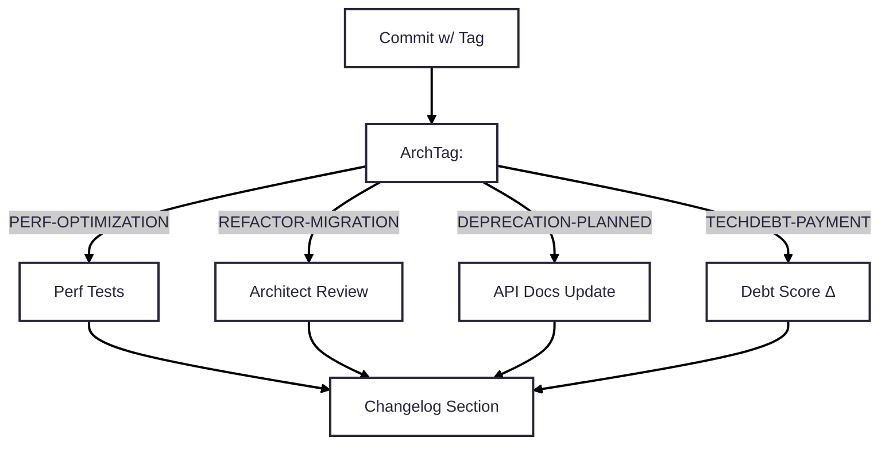

# 🚀 Production Git Workflow: Standards

-----

Owner: Vadim Rudakov, lefthand67@gmail.com  
Version: 0.4.0  
Birth: 2025-11-29  
Last Modified: 2025-12-01

-----

This handbook sets **MANDATORY** conventions for branching and committing. Adherence ensures professional-grade traceability, enables automated MLOps gates, generates accurate changelogs, and streamlines architectural reviews.

## 1\. Three-Tier Naming Structure

All changes must follow this strictly enforced hierarchy for complete lifecycle context.

| Tier | Component | Purpose | Requirement |
| :--- | :--- | :--- | :--- |
| **TIER 1 (SCOPE)** | Branch Prefix + Ticket ID | Defines the **scope** of work (e.g., `feature/`) and its associated **work item**. | **MANDATORY** for all branches. |
| **TIER 2 (INTENT)** | Commit Title Prefix | Defines **what changed** (Conventional Commits type, e.g., `feat:`, `fix:`). | **MANDATORY** for all commits. |
| **TIER 3 (JUSTIFICATION)** | Architectural Tag ($\text{ArchTag}$) | Defines **why** a structural change was made. Placed in the commit body. | **CONDITIONAL** (Mandatory for `refactor:`, `perf:`, `remove:`). |

-----

## 2\. Tier 1: Scope & Traceability - Branch Prefixing Policy

Branch names **MUST** use the format:

$$\text{<prefix>}/\text{<TICKET-ID>}-\text{<short-kebab-description>}$$

*Names must be lowercase with hyphens. This format enables automatic linking to issues and Pull Requests.*

| Prefix | Work Scope | Example |
| :--- | :--- | :--- |
| `feature/` | New features or significant enhancements/additions. | `feature/MLOPS-456-add-metrics-endpoint` |
| `bugfix/` | Correcting a user-impacting defect/bug. | `bugfix/JIRA-123-login-404-error` |
| `hotfix/` | Urgent fixes applied directly to the production branch. | `hotfix/CRIT-001-payment-gateway-bug` |
| `release/` | Preparation for a formal release (e.g., final testing, version bumps). | `release/v1.2.0-final-prep` |
| `chore/` | Routine maintenance that doesn't fix a bug or add a feature (e.g., documentation, dependency updates). | `chore/TICKET-789-update-deps` |

-----

## 3\. Tiers 2 & 3: Intent & Justification - Conventional Commit Policy

### 3.1 Tier 2: **What** Changed - Commit Title Prefix

The commit title **MUST** start with `<type>: <description>`. The description must be **50 characters maximum** and written in the **imperative mood**.

| Group | Type | Intent | ArchTag Required? | SemVer Impact |
| :--- | :--- | :--- | :--- | :--- |
| **Core** | `feat:` | A new feature or enhancement. | NO | **Minor** |
| | `fix:` | A bug fix. | NO | **Patch** |
| | `remove:` | Intentional and significant deletion/breaking change. | **YES** | **Major** |
| **Architectural** | `refactor:` | Code restructuring that neither fixes a bug nor adds a feature. | **YES** | Patch/Minor |
| | `perf:` | Code change that measurably improves performance. | **YES** | Patch/Minor |
| **Routine** | `docs:` | Changes to documentation only. | NO | None |
| | `test:` | Adding or correcting tests. | NO | None |
| | `chore:` | Routine maintenance, dependency updates, minor clean-up. | NO | None |
| **Internal/Temporary** | `WIP:` | **Incomplete work pushed for backup or context-switching. Must be squashed/rebased before merging.** | NO | None |

### 3.2 Tier 3: **Why** Changed - Architectural Tagging

For commits of type `refactor:`, `perf:`, or **`remove:`**, the architectural intent **MUST** be provided as an $\text{ArchTag}$ (Architectural Tag).

  * **Format:** The tag **MUST** be the **first line** of the commit body: `ArchTag:TAG-NAME` (one tag only).
  * **Syntax Rules:** The tag **MUST NOT** include the `#` symbol or any spaces.
  * **Validation:** CI/CD automation tools will validate the tag's presence and correctness.

| Tag Name | Intent | Heuristic / Automation Gate |
| :--- | :--- | :--- |
| $\text{DEPRECATION-PLANNED}$ | Sunset code, APIs, or features scheduled for removal. | PR requires Architect Approval (Hard Gate). |
| $\text{TECHDEBT-PAYMENT}$ | Reducing complexity, upgrading dependencies, or simplifying code. | Signals maintenance work. |
| $\text{REFACTOR-MIGRATION}$ | Major architecture shift or pattern change (e.g., monolith to microservice). | PR requires Architect Approval (Hard Gate). |
| $\text{PERF-OPTIMIZATION}$ | Code change explicitly addressing a performance bottleneck. | Benchmarks must be provided in the commit body. |

### Example of a full commit with $\text{ArchTag}$

```
refactor: simplify model loading logic

ArchTag:TECHDEBT-PAYMENT
Reduced cyclomatic complexity from 15 to 8, improving maintainability.
```



-----

## 4\. 🚨 Mandatory Procedure: Handling `WIP:` Commits

A `WIP:` type is useful only if its temporary nature is strictly enforced. Allowing `WIP:` commits to pollute the final, merged history defeats the purpose of Conventional Commits and introduces unnecessary noise and technical debt.

The `WIP:` commit type is strictly for **personal backup and context switching** on feature branches. It **MUST NOT** be present in the final commit history of any main branch (e.g., `main`, `develop`).

### A. **The Enforcement Gate: Interactive Rebase**

Before opening a Pull Request (PR), all $\text{WIP:}$ commits **MUST** be consolidated (squashed) into one or more **atomic commits** using a valid semantic type ($\text{feat:}$, $\text{fix:}$, etc.).

1.  **Start Interactive Rebase:** Execute `git rebase -i <target-branch>` (e.g., `git rebase -i develop`).
2.  **Edit Commit List:** Change the action for every $\text{WIP:}$ commit from `pick` to **`squash` ($\text{s}$)** or **`fixup` ($\text{f}$)**.
3.  **Finalize Message:** Ensure the final, consolidated commit message is a single, valid, semantic commit title and body.

### B. **PR System Guardrails (Hard Gates)**

  * **CI/CD Block:** The CI/CD pipeline is configured to automatically **fail a Pull Request** if any commit in the branch's history contains the prefix $\text{WIP:}$. This is a **hard technical gate**.
  * **Mandatory Merge Strategy:** The repository is configured to **enforce "Squash and Merge"** for all feature branches into mainline branches. This guarantees that the final history is composed of single, clean, semantic commits.

The most effective enforcement mechanism is at the code review and merge gate.

| Policy | Implementation | Rationale |
| :--- | :--- | :--- |
| **PR Status Check** | Configure your CI/CD system (e.g., GitHub Actions, GitLab CI, Azure DevOps Pipelines) to run a script that **fails the build** if any commit in the PR history (prior to merge) contains the regex pattern `^WIP:` in its title. | This is a **hard gate**. It prevents developer oversight from reaching the main codebase, forcing the immediate correction of the branch history. |
| **Reviewer Responsibility** | Peer reviewers are explicitly tasked with a **quick history audit**. The reviewer must verbally confirm that the history is clean and semantic before approving the PR. | Provides a human layer of quality control, ensuring the final commit message correctly reflects the change's semantic intent and is well-written. |
| **Enforce Squash Merge** | Set the default merge strategy on your repository to **"Squash and Merge"** or **"Rebase and Merge"**. | This ensures that the final commit object added to the target branch is a single, clean commit, overriding potentially messy individual commits from the feature branch. (Note: "Rebase and Merge" still brings individual commits but makes the history linear; "Squash and Merge" is the cleaner option for enforcing a single semantic message.) |

### C. **Guidance: When to Use `WIP:` vs. Standard Commit Types**

New engineers must understand the difference to avoid misusing `WIP:`.

| Scenario | Recommended Type | Rationale |
| :--- | :--- | :--- |
| **Saving work** at the end of the day or switching machines. | `WIP: short summary of current state` | Work is incomplete, not ready for review, and exists purely for personal continuity. Must be squashed later. |
| **Completing a logical unit** of work (e.g., finishing the utility function signature, adding a new test). | `test: add unit test for X service` or `refactor: extract Z function from module A` | The change is coherent, stable, and useful, even if the overall feature is unfinished. It improves branch history readability *before* the final squash. |
| **Fixing a minor bug** discovered while working on a feature. | `fix: prevent divide by zero in function Y` | This is a small, atomic fix that is technically correct and may be valuable on its own. It can be squashed later or kept as a separate atomic commit. |

**Key Takeaway:** If the commit is stable, complete, and describes an atomic, logical change that could stand on its own in the history, use a standard type. If the code is broken, half-finished, or purely a checkpoint, use `WIP:`.

-----

## 5\. 🧠 The Guiding Principle: Atomic Commits

The goal of every feature branch's final history is **logical atomicity**. An **Atomic Commit** is a self-contained, complete, and logically isolated unit of work.

### Rules of Atomicity

  * **Rule 1: One Goal Per Commit.** A commit must achieve one objective only (e.g., *refactor logic*, *add unit tests*, *fix a bug*).
  * **Rule 2: Commits Must Be Stable.** Every commit in the final, merged history **MUST** be buildable and pass all tests. This is mandatory for advanced diagnostic tools like $\text{git bisect}$. **Broken commits are technical debt.**
  * **Rule 3: Cohesive Narrative.** The sequence of commits in a Pull Request (PR) must tell a clear story of how the feature was developed, making it easy for reviewers to follow the logic.

### The "Commit by Logic" Workflow

To create atomic commits, **DO NOT** use `git add .` indiscriminately.

| Step | Action | Tool | Goal |
| :--- | :--- | :--- | :--- |
| **Stage Selectively** | Use the patch utility to stage only changes relevant to a single logical task. | `git add -p` | **Group changes by function and purpose,** not by file or timing. |
| **Review and Commit** | Review the staged changes (`git diff --staged`). If they represent one complete, stable, logical step, commit them with a semantic type. | `git commit -m "feat: implement X interface"` | Ensure the commit is **atomic**. |
| **Iterate and Clean** | Perform the rebase and squashing procedure ($\text{Section 4}$). | `git rebase -i` | Produce a clean, coherent history ready for review and final merge. |

This disciplined approach ensures that your contributions are professionally structured, easily maintainable, and maximally effective for the long-term health of our engineering systems.

-----

## 6\. Quick Reference, Enforcement, and Pitfalls

### 6.1 Quick Reference Table

| Branch Prefix | Commit Prefix Examples | ArchTag Required? | Key Automation Trigger / Gate |
| :--- | :--- | :--- | :--- |
| `feature/`, `bugfix/`, ` chore/  `| `feat:`, `fix:`, `docs:`, `chore:` | NO | Changelog generation; CI pipeline. |
| **Any** | `refactor:`, `perf:`, `remove:` | **YES** | **Architectural Review Gate** (CI/CD block). |
| **Any** | `WIP:` | NO | **CI BLOCK** (Failure to pass the Pre-Merge History Check). |

### 6.2 Enforcement

  * **CI/CD Pipeline:** The pipeline **MUST** block a merge if:
    1.  A commit of type `refactor:`, `perf:`, or `remove:` is missing a valid $\text{ArchTag}$.
    2.  Any commit in the PR history contains the prefix $\text{WIP:}$.
  * **Architectural Review Gate:** PRs containing $\text{ArchTag:REFACTOR-MIGRATION}$ or $\text{ArchTag:DEPRECATION-PLANNED}$ **MUST** receive explicit approval from an Architect/Principal Engineer *before* merging.

### 6.3 Common Pitfalls

| Pitfall | Consequence | Mitigation |
| :--- | :--- | :--- |
| Forgetting the **Ticket ID** in the branch name. | No automatic issue linking; traceability loss. | Use templates; set branch protection rules. |
| Commit titles exceeding **50 characters**. | Poor changelog readability; automation tools truncate. | Use pre-commit hooks to check length. |
| Invalid or missing **ArchTag** on required commit types. | **CI BLOCK** (Failure to pass the Architectural Review Gate). | Check the tag list and ensure it's the first line in the commit body. |
